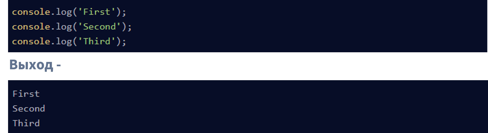
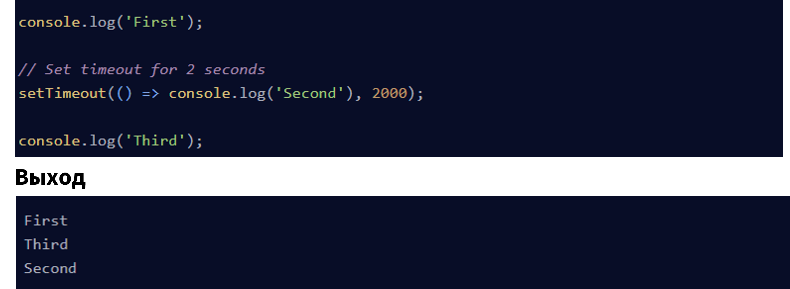
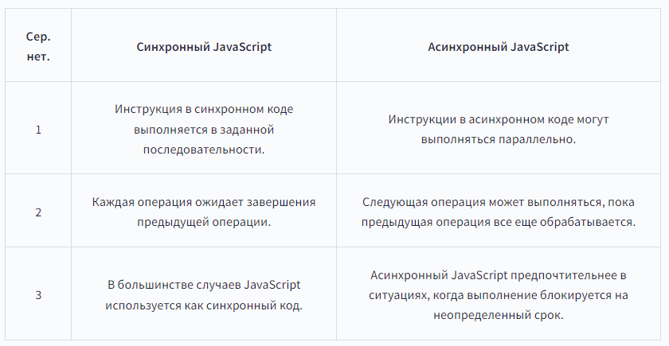
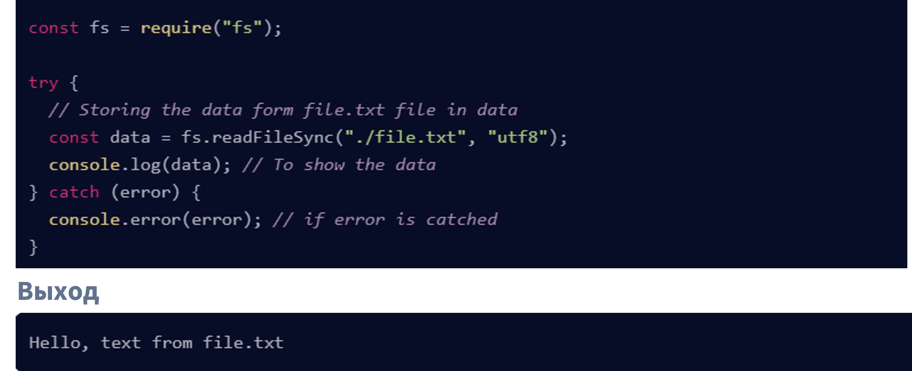
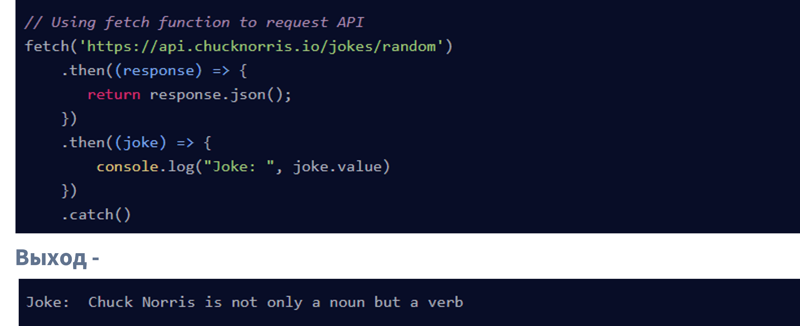
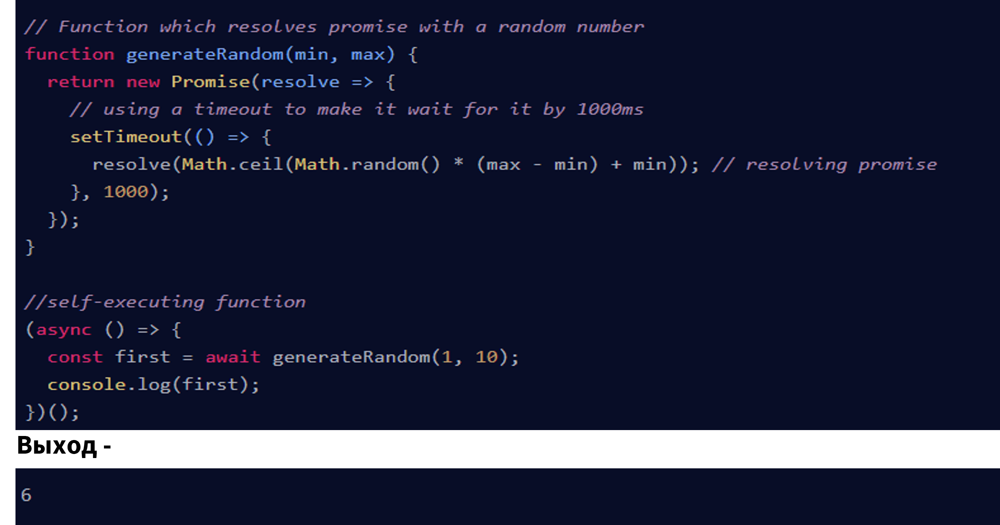
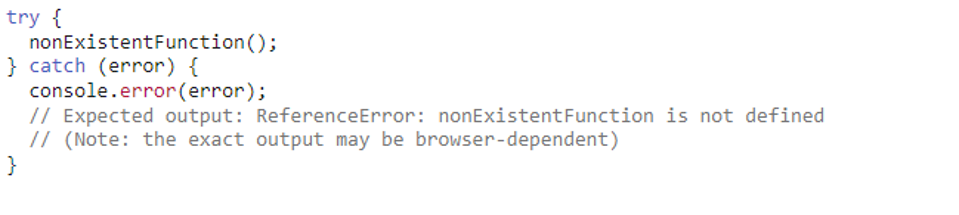
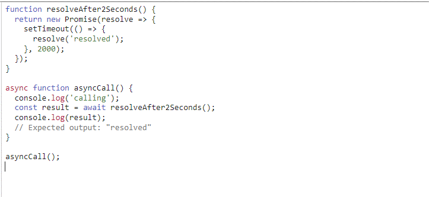

# Синхронный и асинхронный JavaScript:
## Что такое синхронность в JavaScript?
### Поскольку его базовый язык JavaScript является синхронным. Синхронный означает, что код выполняется в определенной последовательности инструкций, заданных в программе. Каждая инструкция ожидает, пока предыдущая инструкция завершит свое выполнение.
### См. следующий пример кода синхронного JavaScript — пример кода —

### В приведенном выше фрагменте кода JavaScript даны три строки инструкций. Каждая инструкция запускается один раз после выполнения предыдущей инструкции. Из-за этой синхронной природы javascript мы получаем вывод журналов консоли в той последовательности, которую мы указали в программе.
#
# Что такое асинхронность в JavaScript?
### Как мы видели в примере с синхронным кодом, все инструкции в программе выполняются одна за другой, и каждая инструкция ожидает выполнения предыдущей инструкции. Из-за такой природы синхронного программирования иногда важные инструкции блокируются из-за некоторых предыдущих инструкций, что вызывает задержку в пользовательском интерфейсе. Асинхронное выполнение кода позволяет выполнять следующие инструкции немедленно и не блокирует поток из-за предыдущих инструкций.
### См. следующий пример кода, чтобы понять, как javascript работает асинхронно:
### Пример кода -

### В чем разница между синхронным и асинхронным JavaScript?

## Примеры для синхронного в JavaScript
### Синхронное чтение файлов
### Рассмотрим следующий пример кода, здесь синхронный javascript используется для чтения данных из файла file.txt . Здесь мы используем функцию readFileSync() , которая работает синхронно без каких-либо обещаний.
### Пример кода -

## Использование функции fetch() для запроса API в браузере
### В следующем примере кода мы использовали функцию fetch() , которая удобна для выполнения запросов от клиентских API к серверным.
### Пример кода -

### Как вы можете видеть в выводе, мы получили шутку из API случайных шуток Чака Норриса, который является открытым исходным кодом, а ссылка для выполнения запросов на получение указана в коде. Здесь мы преобразовали данный ответ в формат JSON и далее получили доступ к значению из объекта для доступа к шутке.
## Генерация случайных чисел с функцией Promise
### Ниже приведен пример кода генерации случайных чисел в заданном диапазоне с помощью функции обещания. Здесь мы использовали асинхронный вызов в самовыполняющейся функции и разрешили промис в определении функции generateRandom() .
### Пример кода -

#
# try...catch
### The try...catch statement is comprised of a try block and either a catch block, a finally block, or both. The code in the try block is executed first, and if it throws an exception, the code in the catch block will be executed. The code in the finally block will always be executed before control flow exits the entire construct. 

## асинхронная функция
### Объявление async functionобъявляет асинхронную функцию, где awaitключевое слово разрешено в теле функции. Ключевые слова asyncи awaitпозволяют писать асинхронное поведение на основе промисов в более чистом стиле, избегая необходимости явно настраивать цепочки промисов.

